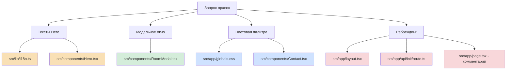

# План: Ребрендинг + обновление цветовой палитры

## Обзор

Переход от «Guest House» к «Guest Houses» с заменой зелёной палитры на тёплую коричневую.

---

## 1. HERO — тексты и структура

### 1.1 Обновить переводы в [`src/lib/i18n.ts`](src/lib/i18n.ts)

**Русский (ru):**
| Поле | Было | Стало |
|------|------|-------|
| `hero.title1` | `Добро пожаловать в` | `Ivanovka` |
| `hero.title2` | `уголок спокойствия` | `Guest Houses` |
| `hero.description` | `Оставьте суету позади...` | `Уютные гостевые дома в сердце природы Исмаиллы. Погрузитесь в атмосферу спокойствия, уюта и загородного отдыха. Здесь природа, приватность и комфорт соединяются в одном пространстве — идеально для семей, друзей и тихих уикендов вдали от города.` |
| `hero.btnRooms` | `Наши домики` | `Каталог Домов` |
| `hero.btnBook` | *(новое поле)* | `Забронировать` |

**Английский (en):**
| Поле | Было | Стало |
|------|------|-------|
| `hero.title1` | `Welcome to a` | `Ivanovka` |
| `hero.title2` | `corner of tranquility` | `Guest Houses` |
| `hero.description` | `Leave the hustle behind...` | `Cozy guest houses in the heart of Ismayilli nature. Immerse yourself in tranquility, comfort and countryside living. Here nature, privacy and comfort come together in one space — perfect for families, friends and quiet weekends away from the city.` |
| `hero.btnRooms` | `Our Cottages` | `Guest Houses Catalog` |
| `hero.btnBook` | *(новое поле)* | `Book Now` |

**Азербайджанский (az):**
| Поле | Было | Стало |
|------|------|-------|
| `hero.title1` | `Xoş gəlmisiniz` | `Ivanovka` |
| `hero.title2` | `sakitlik guşəsinə` | `Guest Houses` |
| `hero.description` | `İstidirahanı arxada qoyun...` | `İsmayıllı təbiətinin ürəyində istirahət üçün qonaq evləri. Sakitlik, rahatlıq və kənd həyatı atmosferinə dalın. Burada təbiət, məxfilik və rahatlıq bir məkanda birləşir — ailələr, dostlar və şəhərdən uzaq sakit həftəsonları üçün idealdır.` |
| `hero.btnRooms` | `Eviklərimiz` | `Evlər Kataloqu` |
| `hero.btnBook` | *(новое поле)* | `Rezervasiya` |

### 1.2 Обновить H1 в [`src/components/Hero.tsx`](src/components/Hero.tsx:34)

**Было:**
```tsx
<h1 className="text-3xl sm:text-4xl md:text-5xl lg:text-6xl font-bold leading-tight text-white">
  {t.hero.title1}<br />
  <span className="text-primary">{t.hero.title2}</span>
</h1>
```

**Стало:**
```tsx
<h1 className="text-3xl sm:text-4xl md:text-5xl lg:text-6xl font-bold leading-tight text-white">
  {t.hero.title1}<br />
  <span className="text-primary">{t.hero.title2}</span>
</h1>
```

Структура H1 остаётся двухстрочной, но теперь:
- Строка 1: `Ivanovka` (белая)
- Строка 2: `Guest Houses` (цвет primary, который станет коричневым)

### 1.3 Заменить текст кнопки WhatsApp в [`src/components/Hero.tsx`](src/components/Hero.tsx:48-53)

**Было:**
```tsx
<Button asChild size="lg" className="gap-2 bg-[#25D366] hover:bg-[#20BD5A] px-8">
  <a href={`https://wa.me/${phone.replace(/[^0-9]/g, '')}`} target="_blank" rel="noopener noreferrer">
    <WhatsAppIcon className="w-5 h-5" />
    WhatsApp
  </a>
</Button>
```

**Стало:**
```tsx
<Button asChild size="lg" className="gap-2 bg-[#25D366] hover:bg-[#20BD5A] px-8">
  <a href={`https://wa.me/${phone.replace(/[^0-9]/g, '')}`} target="_blank" rel="noopener noreferrer">
    <WhatsAppIcon className="w-5 h-5" />
    {t.hero.btnBook}
  </a>
</Button>
```

Иконка WhatsApp остаётся, текст меняется на «Забронировать» / «Book Now» / «Rezervasiya».

---

## 2. Модальное окно домов — размер и фон

### 2.1 Увеличить размер модалки на десктопе в [`src/components/RoomModal.tsx`](src/components/RoomModal.tsx:49)

**Было:**
```tsx
<DialogContent className="sm:max-w-[900px] lg:max-w-[1000px] max-h-[90vh] overflow-y-auto overflow-x-hidden w-[95vw] max-w-[95vw] sm:w-auto sm:max-w-[900px]">
```

**Стало:**
```tsx
<DialogContent className="sm:max-w-[900px] lg:max-w-[1200px] max-h-[90vh] overflow-y-auto overflow-x-hidden w-[95vw] max-w-[95vw] sm:w-auto sm:max-w-[900px]">
```

Изменение: `lg:max-w-[1000px]` → `lg:max-w-[1200px]`

### 2.2 Заменить белый фон внутри модалки на #F7E9D7

Добавить кастомный фон к `DialogContent` в RoomModal:

```tsx
<DialogContent className="sm:max-w-[900px] lg:max-w-[1200px] max-h-[90vh] overflow-y-auto overflow-x-hidden w-[95vw] max-w-[95vw] sm:w-auto sm:max-w-[900px] bg-[#F7E9D7]">
```

Также обновить фон внутренних `Card` компонентов — они используют `bg-background` по умолчанию. Нужно либо:
- Переопределить `--card` CSS-переменную внутри модалки, либо
- Добавить `bg-[#F7E9D7]` напрямую к Card компонентам внутри RoomModal

**Рекомендация:** Добавить обёрточный div с `bg-[#F7E9D7]` и переопределить `--card` локально:

```tsx
<div className="bg-[#F7E9D7] [--card:#F7E9D7] [--card-foreground:#402713]">
  {/* содержимое модалки */}
</div>
```

---

## 3. Цветовая палитра

### 3.1 Обновить CSS-переменные в [`src/app/globals.css`](src/app/globals.css:46-83)

Новые цвета и их hex → oklch конверсия:

| Переменная | Было (oklch) | Стало (hex) | Назначение |
|------------|-------------|-------------|------------|
| `--primary` | `oklch(0.45 0.12 145)` — тёмно-зелёный | `#402713` — тёмно-коричневый | Основной акцент |
| `--primary-foreground` | `oklch(0.98 0.005 85)` | `#F7E9D7` — кремовый | Текст на primary |
| `--secondary` | `oklch(0.92 0.02 75)` — светло-зелёный | `#634B37` — средне-коричневый | Вторичный акцент |
| `--secondary-foreground` | `oklch(0.3 0.03 75)` | `#F7E9D7` — кремовый | Текст на secondary |
| `--ring` | `oklch(0.45 0.12 145)` | `#402713` | Обводка фокуса |
| `--chart-1` | `oklch(0.45 0.12 145)` | `#402713` | Графики |
| `--sidebar-primary` | `oklch(0.45 0.12 145)` | `#402713` | Сайдбар |
| `--sidebar-ring` | `oklch(0.45 0.12 145)` | `#402713` | Сайдбар |

Также обновить `.dark` блок аналогично.

### 3.2 Заменить фон секции Contact в [`src/components/Contact.tsx`](src/components/Contact.tsx:22)

**Было:**
```tsx
<section id="contact" className="relative z-10 min-h-screen flex items-center py-16 bg-primary text-white">
```

**Стало:**
```tsx
<section id="contact" className="relative z-10 min-h-screen flex items-center py-16 bg-[#261A0B] text-white">
```

Жёстко задаём цвет `#261A0B` вместо `bg-primary`, чтобы секция контактов имела свой уникальный тёмный фон.

### 3.3 Обновить скроллбар в [`src/app/globals.css`](src/app/globals.css:166-172)

**Было:**
```css
::-webkit-scrollbar-thumb {
  background: oklch(0.45 0.12 145);
}
::-webkit-scrollbar-thumb:hover {
  background: oklch(0.55 0.15 145);
}
```

**Стало:**
```css
::-webkit-scrollbar-thumb {
  background: #402713;
}
::-webkit-scrollbar-thumb:hover {
  background: #634B37;
}
```

---

## 4. Ребрендинг Guest House → Guest Houses

### 4.1 Метаданные в [`src/app/layout.tsx`](src/app/layout.tsx:18-28)

| Поле | Было | Стало |
|------|------|-------|
| `title` | `Guest House Ivanovka \| Отдых в горах Азербайджана` | `Ivanovka Guest Houses \| Отдых в горах Азербайджана` |
| `description` | `Уютный гостевой дом в Исмаиллы...` | `Уютные гостевые дома в Исмаиллы...` |
| `keywords` | `гостевой дом` | `гостевые дома` |
| `authors` | `Guest House Ivanovka` | `Ivanovka Guest Houses` |
| OpenGraph `title` | `Guest House Ivanovka...` | `Ivanovka Guest Houses...` |
| OpenGraph `description` | `Уютный гостевой дом...` | `Уютные гостевые дома...` |

### 4.2 Начальные данные в [`src/app/api/init/route.ts`](src/app/api/init/route.ts:72-76)

```typescript
// Было:
description: 'Уютный гостевой дом в горах Азербайджана...'
// Стало:
description: 'Уютные гостевые дома в горах Азербайджана...'
```

### 4.3 Комментарии и localStorage ключи

- [`src/app/page.tsx`](src/app/page.tsx:3) — комментарий `Guest House Gabala`
- [`src/lib/LanguageContext.tsx`](src/lib/LanguageContext.tsx:18) — `guesthouse-lang` в localStorage (можно оставить, чтобы не сбрасывать настройки пользователей)
- [`src/lib/schema.ts`](src/lib/schema.ts:7) — `guesthouse.db` (можно оставить, чтобы не терять данные)

> **Примечание:** localStorage ключ и имя БД лучше не менять во избежание потери данных пользователей.

---

## Диаграмма затрагиваемых файлов



---

## Порядок выполнения

1. **Цвета** — обновить `globals.css` (первично, т.к. влияет на всё)
2. **i18n** — обновить тексты в `i18n.ts` для всех 3 языков
3. **Hero** — обновить структуру H1 и кнопку в `Hero.tsx`
4. **RoomModal** — увеличить размер + сменить фон
5. **Contact** — заменить фон на `#261A0B`
6. **Ребрендинг** — обновить `layout.tsx`, `api/init/route.ts`, комментарий в `page.tsx`
7. **Тестирование** — визуальная проверка всех секций
