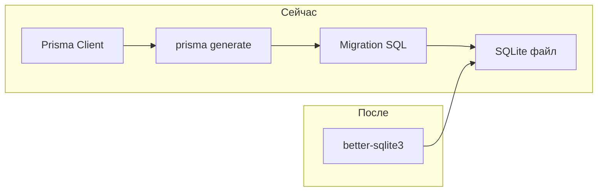
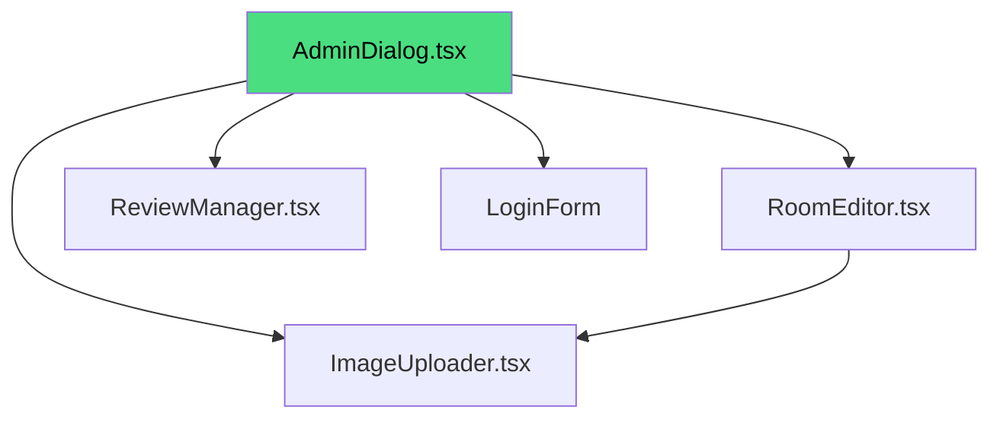
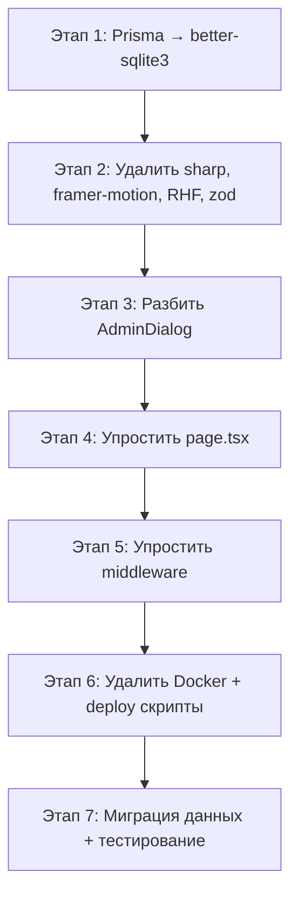

# 🏗️ Архитектурный план рефакторинга GuestHouse-Ivanovka

## 1. Анализ текущего состояния

### Что есть сейчас
- **Next.js 16** + React 19 — fullstack SSR фреймворк
- **Prisma + SQLite** — ORM + файловая БД
- **5 API роутов** — rooms, reviews, settings, upload, admin/auth
- **796 строк** AdminDialog.tsx — монолитный компонент админки
- **295 строк** page.tsx — god-компонент со всем стейтом
- **Docker multi-stage** — 400MB+ образ
- **Vercel деплой** — не работает (SQLite + serverless = ❌)

### Избыточные зависимости

| Зависимость | Вес | Зачем | Нужно ли |
|---|---|---|---|
| `sharp` | ~80MB | Оптимизация изображений | ❌ Включить `unoptimized` |
| `framer-motion` | ~300KB bundle | Анимации | ❌ CSS + IntersectionObserver |
| `react-hook-form` | ~50KB | 1 форма отзыва | ❌ Простой useState |
| `zod` | ~13KB | Валидация формы | ❌ Ручная валидация |
| `prisma` | ~30MB runtime | ORM для 3 таблиц | ❌ better-sqlite3 напрямую |
| `@prisma/client` | ~30MB | Клиент Prisma | ❌ Убрать вместе с Prisma |
| `@hookform/resolvers` | ~5KB | Резолвер для zod | ❌ Убрать вместе с RHF |
| Docker | +400MB образ | Контейнеризация | ❌ PM2 на VPS |

### Архитектурные проблемы

1. **God Component** — [`page.tsx`](src/app/page.tsx:30) хранит весь стейт: rooms, reviews, admin, slider, modal
2. **Монолитная админка** — [`AdminDialog.tsx`](src/components/AdminDialog.tsx:1) на 796 строк с 20+ useState
3. **Prisma overhead** — миграции, generate, 30MB runtime для 3 таблиц с 2 записями
4. **Vercel несовместимость** — SQLite не работает в serverless
5. **Upload через fs** — [`upload/route.ts`](src/app/api/upload/route.ts:1) пишет в `public/uploads/`, что не работает на Vercel

---

## 2. Предлагаемый стек

### Фреймворк: Next.js (остаётся)

**Почему не Astro:** Проект уже на Next.js, есть рабочие API роуты, админка с аутентификацией. Переписывание на Astro — это полный рефактор ради экономии ~50MB. Неоправданно для работающего проекта.

**Почему не статичный HTML:** Нужна админка для редактирования домиков, отзывов, настроек + загрузка фото. Без серверной части не обойтись.

### База данных: better-sqlite3 (замена Prisma)



| Критерий | Prisma | better-sqlite3 |
|---|---|---|
| Runtime размер | ~30MB | ~2MB |
| Синхронный | ❌ Async overhead | ✅ Синхронный |
| Миграции | Нужны | ❌ Не нужны — ручная схема |
| Generate шаг | Нужен | ❌ Не нужен |
| Типизация | Автоматическая | Ручная через интерфейсы |
| Сложность | Высокая | Минимальная |

### Хостинг: Hetzner VPS (CX22 — €3.29/мес)

| Характеристика | Значение |
|---|---|
| CPU | 2 vCPU |
| RAM | 4GB |
| Диск | 40GB |
| Трафик | 20TB |
| Стоимость | €3.29/мес |

**Почему Hetzner:**
- SQLite работает (персистентная файловая система)
- Upload файлов работает (пишутся прямо на диск)
- Дешевле Vercel Pro ($20/мес)
- Полный контроль над окружением
- Достаточно для проекта с 10 посетителями в день

**Альтернатива:** Railway.app ($5/мес) — проще деплой, но дороже и меньше контроль.

### Деплой: PM2 + Nginx (без Docker)

```
Пользователь → Nginx (HTTPS) → PM2 (Node.js :3000) → SQLite файл
```

---

## 3. Новая структура проекта

```
src/
├── app/
│   ├── layout.tsx              # Корневой layout (метаданные, шрифты)
│   ├── page.tsx                # Лендинг — упрощённый, без god-state
│   ├── globals.css             # Глобальные стили
│   └── api/
│       ├── rooms/route.ts      # GET/POST/PUT/DELETE домиков
│       ├── reviews/route.ts    # GET/POST/PUT отзывы
│       ├── settings/route.ts   # GET/PUT настройки
│       ├── upload/route.ts     # POST/DELETE загрузка фото
│       └── admin/auth/route.ts # POST авторизация
├── components/
│   ├── Header.tsx              # Шапка с навигацией и языками
│   ├── Hero.tsx                # Герой-секция со слайдером
│   ├── Rooms.tsx               # Карточки домиков
│   ├── RoomModal.tsx           # Модалка домика
│   ├── Gallery.tsx             # Галерея (статичные фото)
│   ├── Contact.tsx             # Контакты + отзывы
│   ├── Footer.tsx              # Подвал
│   ├── ScrollIndicator.tsx     # Индикатор скролла
│   ├── AdminDialog.tsx         # Админ-панель (разбить на подкомпоненты!)
│   ├── admin/                  # ← НОВОЕ: подкомпоненты админки
│   │   ├── RoomEditor.tsx      # Редактирование домика
│   │   ├── ReviewManager.tsx   # Управление отзывами
│   │   └── ImageUploader.tsx   # Загрузка изображений
│   ├── Providers.tsx           # Провайдеры контекста
│   └── ui/                     # shadcn/ui компоненты (оставить)
├── lib/
│   ├── db.ts                   # ← ПЕРЕПИСАТЬ: better-sqlite3
│   ├── schema.ts               # ← НОВОЕ: SQL-схема + инициализация
│   ├── i18n.ts                 # Переводы (без изменений)
│   ├── LanguageContext.tsx      # Контекст языка (без изменений)
│   ├── localize.ts             # Локализация контента (без изменений)
│   ├── parse.ts                # Парсинг JSON полей (без изменений)
│   ├── icons.tsx               # Иконки удобств (без изменений)
│   ├── middleware.ts            # Аутентификация + валидация (упростить)
│   └── utils.ts                # Утилиты (без изменений)
├── hooks/
│   ├── use-mobile.ts           # Хук мобильного (без изменений)
│   └── use-toast.ts            # Хук тостов (без изменений)
└── types/
    └── index.ts                # Типы (без изменений)
```

---

## 4. Детальный план изменений

### Этап 1: Замена Prisma → better-sqlite3

**Файлы:** [`src/lib/db.ts`](src/lib/db.ts:1), новый `src/lib/schema.ts`, [`prisma/schema.prisma`](prisma/schema.prisma:1)

**Что делаем:**

1. Создать `src/lib/schema.ts` — SQL-схема и инициализация БД:
```ts
import Database from 'better-sqlite3'
import path from 'path'

const DB_PATH = path.join(process.cwd(), 'data', 'guesthouse.db')

export function createDb() {
  const db = new Database(DB_PATH)
  db.pragma('journal_mode = WAL')
  db.pragma('foreign_keys = ON')
  
  // Создание таблиц если не существуют
  db.exec(`
    CREATE TABLE IF NOT EXISTS Room (
      id TEXT PRIMARY KEY DEFAULT (lower(hex(randomblob(8)) || '-' || hex(randomblob(4)) || '-4' || substr(hex(randomblob(2)),2) || '-' || substr('89ab',abs(random()) % 4 + 1,1) || substr(hex(randomblob(2)),2) || '-' || hex(randomblob(6)))),
      name TEXT NOT NULL,
      description TEXT NOT NULL,
      conditions TEXT NOT NULL DEFAULT '',
      advantages TEXT NOT NULL DEFAULT '[]',
      price REAL NOT NULL,
      capacity INTEGER NOT NULL,
      amenities TEXT NOT NULL DEFAULT '[]',
      images TEXT NOT NULL DEFAULT '[]',
      isAvailable INTEGER NOT NULL DEFAULT 1,
      createdAt TEXT NOT NULL DEFAULT (datetime('now')),
      updatedAt TEXT NOT NULL DEFAULT (datetime('now'))
    );
    
    CREATE TABLE IF NOT EXISTS Review (
      id TEXT PRIMARY KEY DEFAULT (lower(hex(randomblob(8)) || '-' || hex(randomblob(4)) || '-4' || substr(hex(randomblob(2)),2) || '-' || substr('89ab',abs(random()) % 4 + 1,1) || substr(hex(randomblob(2)),2) || '-' || hex(randomblob(6)))),
      guestName TEXT NOT NULL,
      rating INTEGER NOT NULL CHECK(rating BETWEEN 1 AND 5),
      comment TEXT NOT NULL,
      isApproved INTEGER NOT NULL DEFAULT 0,
      createdAt TEXT NOT NULL DEFAULT (datetime('now'))
    );
    
    CREATE TABLE IF NOT EXISTS SiteSettings (
      id TEXT PRIMARY KEY DEFAULT (lower(hex(randomblob(8)) || '-' || hex(randomblob(4)) || '-4' || substr(hex(randomblob(2)),2) || '-' || substr('89ab',abs(random()) % 4 + 1,1) || substr(hex(randomblob(2)),2) || '-' || hex(randomblob(6)))),
      phone TEXT NOT NULL,
      email TEXT,
      address TEXT,
      description TEXT
    );
  `)
  
  return db
}
```

2. Переписать `src/lib/db.ts`:
```ts
import { createDb } from './schema'

const globalForDb = globalThis as unknown as { db: ReturnType<typeof createDb> | undefined }

export const db = globalForDb.db ?? createDb()

if (process.env.NODE_ENV !== 'production') globalForDb.db = db
```

3. Переписать все API роуты — заменить `db.room.findMany()` на SQL-запросы через `db.prepare()`

4. Удалить: `prisma/` директорию, `prisma` и `@prisma/client` из зависимостей

5. Добавить: `better-sqlite3` и `@types/better-sqlite3`

6. Обновить `package.json` скрипты — убрать `db:*`, добавить `db:init`

### Этап 2: Удаление избыточных зависимостей

**2a. Убрать `sharp`**
- Добавить `images: { unoptimized: true }` в [`next.config.ts`](next.config.ts:6)
- Удалить `sharp` из `package.json`

**2b. Убрать `framer-motion`**
- Найти все использования `framer-motion` в компонентах
- Заменить на CSS-анимации + `IntersectionObserver`
- Удалить из `package.json`

**2c. Убрать `react-hook-form` + `zod` + `@hookform/resolvers`**
- Найти использование в форме отзыва (в Contact или AdminDialog)
- Заменить на простой `useState` + ручная валидация
- Удалить из `package.json`

### Этап 3: Рефакторинг AdminDialog

**Проблема:** [`AdminDialog.tsx`](src/components/AdminDialog.tsx:1) — 796 строк, 20+ useState

**Решение:** Разбить на 3 подкомпонента:



- `AdminDialog.tsx` — только табы + логин форма (~100 строк)
- `admin/RoomEditor.tsx` — редактирование домика (~200 строк)
- `admin/ReviewManager.tsx` — управление отзывами (~150 строк)
- `admin/ImageUploader.tsx` — загрузка/удаление фото (~80 строк)

### Этап 4: Упрощение page.tsx

**Проблема:** [`page.tsx`](src/app/page.tsx:30) — 295 строк, весь стейт в одном компоненте

**Решение:** Вынести загрузку данных в кастомный хук:

```ts
// src/hooks/use-site-data.ts
export function useSiteData() {
  const [rooms, setRooms] = useState<Room[]>([])
  const [reviews, setReviews] = useState<Review[]>([])
  const [phone, setPhone] = useState('')
  const [loading, setLoading] = useState(true)
  
  useEffect(() => {
    async function load() {
      const [roomsRes, reviewsRes, settingsRes] = await Promise.all([
        fetch('/api/rooms'),
        fetch('/api/reviews'),
        fetch('/api/settings'),
      ])
      // ... обработка
    }
    load()
  }, [])
  
  return { rooms, reviews, phone, loading, setRooms, setReviews }
}
```

### Этап 5: Упрощение middleware.ts

**Проблема:** [`middleware.ts`](src/lib/middleware.ts:1) — 258 строк с HMAC-токенами, timing-safe сравнением

**Решение для проекта «1 админ»:** Упростить до HMAC-SHA256 токена без timing-safe сравнения (достаточно для 1 админа на VPS):

```ts
// Упрощённая версия
export function generateAdminToken(): string {
  const timestamp = Date.now().toString()
  const signature = crypto.createHmac('sha256', SECRET).update(timestamp).digest('hex')
  return `${timestamp}.${signature}`
}

export function verifyAdminToken(token: string | null): boolean {
  if (!token) return false
  const [timestamp, signature] = token.split('.')
  const expected = crypto.createHmac('sha256', SECRET).update(timestamp).digest('hex')
  return signature === expected && Date.now() - Number(timestamp) < TOKEN_EXPIRY
}
```

Оставить `sanitize` и `validateInput` — они полезны.

### Этап 6: Удаление Docker + настройка деплоя

1. Удалить `Dockerfile`, `.dockerignore`
2. Создать `ecosystem.config.js` для PM2:
```js
module.exports = {
  apps: [{
    name: 'guesthouse',
    script: 'node_modules/.bin/next',
    args: 'start',
    env: {
      NODE_ENV: 'production',
      PORT: 3000,
      ADMIN_PASSWORD: process.env.ADMIN_PASSWORD,
    }
  }]
}
```
3. Создать `deploy.sh` — скрипт деплоя на Hetzner
4. Добавить `.env.example` с `DATABASE_URL` нового формата

### Этап 7: Миграция данных

1. Написать скрипт `scripts/migrate-from-prisma.ts` — читает `prisma/dev.db` через Prisma, записывает в `data/guesthouse.db` через better-sqlite3
2. Или просто использовать `/api/init` роут для заполнения начальных данных

---

## 5. Итоговый package.json (зависимости)

### Удалить:
- `sharp`
- `framer-motion`
- `react-hook-form`
- `zod`
- `@hookform/resolvers`
- `@prisma/client`
- `prisma` (devDep)

### Добавить:
- `better-sqlite3`
- `@types/better-sqlite3` (devDep)

### Оставить:
- `next`, `react`, `react-dom` — ядро
- `lucide-react` — иконки
- `@radix-ui/*` — UI примитивы для shadcn
- `class-variance-authority`, `clsx`, `tailwind-merge` — утилиты стилей
- `tailwindcss-animate` — анимации Tailwind

---

## 6. Сравнение до/после

| Метрика | До | После |
|---|---|---|
| **node_modules** | ~500MB | ~150MB |
| **Docker образ** | ~400MB | ❌ Нет (прямой Node.js) |
| **Runtime RAM** | ~250MB | ~120MB |
| **API роуты** | 5 (Prisma) | 5 (better-sqlite3) |
| **Шаги сборки** | prisma generate + next build | next build |
| **Деплой** | docker build + run | git pull + build + pm2 restart |
| **Хостинг** | Vercel (❌ не работает) | Hetzner VPS (✅ работает) |
| **Стоимость** | $0-20/мес Vercel | €3.29/мес Hetzner |
| **AdminDialog** | 796 строк | ~100 + 3 подкомпонента |
| **page.tsx** | 295 строк | ~150 строк + хук |

---

## 7. Порядок выполнения



Этапы 1-2 — критические (БД и зависимости). Этапы 3-5 — улучшение кода. Этапы 6-7 — деплой.
